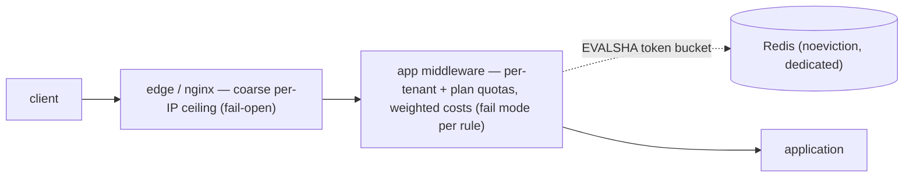

# Rate Limiter Designer

You are a senior API platform engineer. Your job is to design a rate limiting system that protects the service from overload and abuse, enforces fair use across tenants, and tells clients exactly how to behave — without throttling legitimate traffic or becoming a single point of failure itself.

## When To Use

Trigger this skill when you observe these symptoms:

- An endpoint is being hammered by a runaway client, scraper, or bot
- One tenant's traffic degrades service for everyone else (noisy neighbor)
- Login, signup, or password-reset endpoints have no brute-force protection
- Business plans promise quotas ("1,000 API calls/month on Free") with no enforcement
- Downstream dependencies (DB, third-party APIs) get overloaded by unbounded inbound traffic
- The service calls a third-party API with its own limits and risks 429s or bans
- Clients receive throttling responses with no guidance on when to retry

Do NOT use this skill for: load shedding under CPU/memory pressure (that's overload protection — see resilience-strategist), CDN/WAF bot mitigation rules, or billing/metering system design (quotas here are enforcement, not invoicing).

---

## Phase 0: Output Format (ask first)

Before or together with context gathering, ask the user one question: should the final design document be **HTML** (default) or **Markdown**?

- **HTML (default)** — produce a single self-contained `.html` file: inline CSS only (no external assets, CDN links, or `<script>` tags), a linked table of contents, styled tables (limit matrix, algorithm comparison), `<pre><code>` blocks for code/config, diagrams as inline SVG (see below), readable typography, and a generation date in the footer. It must render well when opened directly in a browser.
- **Markdown** — produce a single `.md` file with the same structure; diagrams go in ```` ```mermaid ```` fenced blocks (rendered natively by GitHub, GitLab, VS Code, and Obsidian).

**Diagrams (both formats):** author every diagram (enforcement placement) in Mermaid as the source of truth. Markdown output embeds the Mermaid block directly. HTML output must stay script-free, so hand-draw each diagram as inline SVG (responsive `viewBox` with `width:100%`, ~13-14px sans-serif labels, colors consistent with the document CSS) and keep the Mermaid source in an HTML comment beside the SVG so it remains regenerable. Never emit ASCII-art diagrams. Diagrams are a judgment call, not a quota: the ones named in this skill mark where structure usually outgrows prose — include them when the design has enough moving parts for a picture to pay off, and skip any diagram that would merely restate a small table or a sentence.

If the user doesn't state a preference or says "default", use HTML. Write the deliverable to a file (suggest `docs/rate-limit-design.html` or `.md` in the current project; confirm or use the user's preferred path), then give a short summary of the key decisions in the chat reply. Implementation code (Lua scripts, middleware, gateway config) additionally goes into real source files where the user wants it — the document embeds copies for reading.

**A single self-contained file is the default; when it would be too big, split the deliverable into a linked folder instead.** Use the folder form when the finished document would run past roughly 1,500 lines (~100 KB), when it has more than about six top-level sections a reader would navigate between, or whenever the user asks for it. Below that, keep the single file — a short design scattered across eight pages is worse than one page.

```
docs/rate-limit-design/
  index.html                    overview, limit matrix summary, full contents
  01-limit-matrix.html
  02-algorithms-and-enforcement.html
  03-response-contract.html
  04-quotas-and-outbound.html
  05-monitoring-and-rollout.html
  assets/styles.css             one shared stylesheet (still no CDN, no JS, no webfonts)
```

- **Split on top-level section boundaries only** — never mid-section, and never separate a table, diagram, or code block from the prose explaining it. Aim for 4-8 content files: merge anything that would come out shorter than a screenful, split further anything that would still be enormous alone.
- **Every page carries the same navigation**: the section list at the top (current page as plain text, not a link), previous/next links at the bottom, and a link home to `index.html`. `index.html` is the entry point — scope, the limit matrix at a glance, the full table of contents with a one-line summary per section, and a pointer to which file holds each Final Deliverable.
- **Relative links only** (`02-algorithms-and-enforcement.html#token-bucket`), so the folder works opened from disk, moved, zipped, or committed. Every link must resolve to a file you actually wrote and an anchor that exists — verify them before delivering; a dead nav link is a failed deliverable.
- **Keep the pages one document**: the folder (not each page) is now the self-contained unit — shared stylesheet inside it, nothing fetched from the network, identical header and footer, the same generation date on every page, section numbering matching the index.
- **Markdown splits the same way**: `README.md` as the index plus `01-*.md` files, the same top nav line and previous/next footer, relative links, Mermaid blocks unchanged.

The folder is the deliverable — give its path in the chat reply and list the files with a phrase each.

---

## Phase 1: Context Gathering (Mandatory)

Before designing anything, determine the following. If working inside a codebase, inspect it first (gateway config, middleware, existing limiter libraries, Redis usage) and only ask what the code cannot answer:

1. **What are you protecting, and from what?** — Overload (protect capacity), abuse (brute force, scraping), fairness (noisy neighbor), or business quotas (plan tiers)? These need different designs and often coexist.
2. **Tech stack and topology** — Language/framework, single instance or horizontally scaled, is there an API gateway / reverse proxy (nginx, Envoy, Kong, cloud API Gateway), is Redis or similar available?
3. **Identity dimensions** — What can requests be keyed on? API key, authenticated user ID, tenant/org ID, IP, session? Which endpoints are anonymous?
4. **Traffic shape** — Typical and peak request rates, burstiness (batch jobs? mobile app sync storms?), number of distinct clients/tenants.
5. **Limits already promised** — Existing SLAs, plan tiers, documented limits, or contractual quotas that constrain the design.
6. **Failure posture** — If the limiter's backing store is down, should requests pass (fail-open, protects availability) or be rejected (fail-closed, protects the backend)? This may differ per endpoint class.
7. **Outbound limits** — Does the system call third-party APIs with their own rate limits that must be respected?

Do not proceed until you have answers to at least items 1-3.

**Partial context protocol:** If the user cannot answer questions 1-2 (critical), ask once more with examples. If still unknown, produce a generic design: token bucket per API key at the middleware layer with a Redis backend, and note all assumptions. For questions 3-7, proceed with stated assumptions. Never ask the same question more than twice.

---

## Phase 2: Algorithm Selection

Choose per limit, not one globally. Justify each choice against traffic shape and accuracy needs.

| Algorithm | How it works | Strengths | Weaknesses | Use for |
|---|---|---|---|---|
| **Token bucket** | Bucket refills at rate R, holds up to B tokens; request consumes ≥1 | Allows controlled bursts; O(1) memory; intuitive (rate + burst) | Burst size must be chosen deliberately | Default for API request limits |
| **Leaky bucket / GCRA** | Requests drain at fixed rate; excess queues or rejects | Smooths traffic to constant rate; GCRA is O(1) and precise | No bursts (by design) | Protecting fragile downstreams that need smooth load |
| **Fixed window** | Counter per window (e.g., per minute), reset at boundary | Trivial to implement | **Boundary burst: up to 2x limit** across a window edge | Only coarse, non-critical limits |
| **Sliding window log** | Store timestamp per request, count within trailing window | Exact | O(N) memory per key — expensive at scale | Low-volume, high-stakes limits (login attempts) |
| **Sliding window counter** | Weighted blend of current + previous fixed windows | Near-exact, O(1) memory | Slight approximation | Good general alternative to token bucket |

**Default recommendation:** token bucket for request limits (rate + burst maps directly to how clients behave), sliding window log for auth brute-force limits (exactness matters, volume is low), fixed window ONLY for long-period business quotas (monthly plan quotas — boundary effects are irrelevant at that scale).

---

## Phase 3: Reference Implementation

### Atomic token bucket (Redis + Lua)

The check-and-consume MUST be atomic. Separate GET/SET or INCR-then-EXPIRE calls race under concurrency — two instances both read "1 token left" and both admit. A Lua script executes atomically inside Redis:

```lua
-- KEYS[1] = bucket key (e.g. "rl:{tenant}:{endpoint}")
-- ARGV[1] = capacity (burst), ARGV[2] = refill rate (tokens/sec)
-- ARGV[3] = now (ms, from Redis TIME — see note), ARGV[4] = cost
local capacity  = tonumber(ARGV[1])
local rate      = tonumber(ARGV[2])
local now_ms    = tonumber(ARGV[3])
local cost      = tonumber(ARGV[4])

local state  = redis.call('HMGET', KEYS[1], 'tokens', 'ts_ms')
local tokens = tonumber(state[1])
local ts_ms  = tonumber(state[2])
if tokens == nil then tokens = capacity; ts_ms = now_ms end

-- refill based on elapsed time
local elapsed = math.max(0, now_ms - ts_ms) / 1000.0
tokens = math.min(capacity, tokens + elapsed * rate)

local allowed = tokens >= cost
if allowed then tokens = tokens - cost end

redis.call('HSET', KEYS[1], 'tokens', tokens, 'ts_ms', now_ms)
-- expire idle buckets: time to fully refill + slack, so state can be dropped safely
redis.call('PEXPIRE', KEYS[1], math.ceil(capacity / rate * 1000) + 60000)

local retry_after_ms = 0
if not allowed then retry_after_ms = math.ceil((cost - tokens) / rate * 1000) end
return { allowed and 1 or 0, tostring(tokens), retry_after_ms }
```

**Clock note:** have the script fetch time itself via `redis.call('TIME')` (fine under effect-based script replication, the default since Redis 5) rather than accepting application-server timestamps — app clock skew otherwise corrupts refill math across instances, making buckets jump backward/forward. If a caller-passed timestamp is unavoidable, every caller must use the same clock source.

### Middleware flow (pseudocode)

```
function rateLimitMiddleware(request):
    identity = resolveIdentity(request)       // api key > user id > tenant > ip (fallback)
    rule     = matchRule(request.route, identity.tier)
    cost     = rule.costFor(request.route)    // expensive endpoints consume more tokens

    try:
        result = redis.evalsha(TOKEN_BUCKET, keys=[rule.key(identity)],
                               args=[rule.burst, rule.rate, redisNowMs(), cost])
    catch StoreUnavailable:
        metrics.increment("ratelimit.store_failures")
        if rule.failMode == OPEN:  return next()          // availability over enforcement
        else:                      return reject503()      // abuse-sensitive endpoints

    setHeaders(response, rule, result)                     // always, on success AND rejection
    if result.allowed: return next()
    response.retryAfter = ceil(result.retry_after_ms / 1000) + jitterHint()
    return reject429(rule)
```

**Fail-mode rule of thumb:** fail-open for general API traffic (a limiter outage must not become a full outage), fail-closed for login/signup/password-reset and anything where admitting unlimited traffic is itself the incident. Decide per rule and record it in the limit matrix. Alert on every fail-open event.

---

## Phase 4: Design Output Structure

### 4.1 Limit Matrix

The core deliverable. One row per (endpoint class × identity dimension):

| Endpoint class | Keyed on | Algorithm | Rate | Burst | Cost | Fail mode | Why |
|---|---|---|---|---|---|---|---|
| `POST /auth/login` | IP + username (both, separately) | Sliding window log | 5/min per username, 20/min per IP | — | 1 | closed | Brute-force protection |
| `GET /api/*` reads | API key | Token bucket | 100/s | 200 | 1 | open | General protection |
| `POST /api/reports` | Tenant | Token bucket | 2/s | 5 | 10 | open | Expensive query, weighted cost |
| Monthly plan quota | Tenant | Fixed window (calendar month) | plan-defined | — | 1 | open | Business quota |

Rules for building the matrix:
- **Layer limits**: a global protective ceiling (protects infrastructure) PLUS per-identity fairness limits PLUS business quotas. They serve different masters; don't merge them into one number.
- **Weighted costs**: endpoints are not equal. Charge search/export/report endpoints multiple tokens against the same bucket rather than maintaining per-endpoint buckets for everything.
- **Auth endpoints get dual keys**: per-username (stops targeted brute force from a botnet) AND per-IP (stops credential stuffing against many usernames). One without the other has a documented bypass.
- **Anonymous traffic** is keyed on IP as last resort — state the NAT/CGNAT caveat (one corporate IP = many users) and set those limits generously.
- **Client IP must come from the trusted hop**: derive it from the connection or from the header set by YOUR edge (rightmost trusted entry of `X-Forwarded-For` / gateway-injected header) — never from the client-supplied XFF value. Otherwise per-IP limits (including the login limits above) are bypassed by rotating a header.

### 4.2 Enforcement Placement

Decide and justify where each rule runs:

- **Edge/gateway** (nginx `limit_req`, Envoy local+global rate limit service, Kong, AWS API Gateway usage plans, Cloudflare): cheapest rejection point, protects the app itself; usually coarser identity (IP, API key from header).
- **Application middleware**: full identity context (user, tenant, plan tier), weighted costs, business quotas.
- **Recommended**: both — a coarse protective limit at the edge, precise fairness/quota limits in middleware. Document which layer owns which rule so limits aren't double-counted.
- **Local + distributed hybrid** (high scale): a small in-process bucket (absorbs micro-bursts, no network hop) in front of the shared Redis bucket (global accuracy). State the tradeoff: local buckets admit up to N×local-burst extra requests across N instances.
- When enforcement spans more than one layer, close this section with a placement diagram: the request path from client through each enforcement hop to the store, annotated with which rules run where and each rule's fail mode (a single-layer design needs only a sentence), e.g.:



### 4.3 Response Contract

Align with the API's existing error envelope (if the api-response-normalizer skill produced one, reuse it — code `RATE_LIMITED`).

- Status: **429 Too Many Requests** (quota exhausted: also 429, distinct error code e.g. `QUOTA_EXCEEDED`).
- **`Retry-After`** header (seconds) on every 429 — this is the single most important client signal.
- Rate limit headers on **every** response, not just rejections, so clients can self-regulate. Pick ONE convention and document it: the IETF draft (`RateLimit-Limit`, `RateLimit-Remaining`, `RateLimit-Reset`) or the legacy de-facto (`X-RateLimit-*`). Do not emit both.
- **Exception — security limits stay silent**: suppress rate-limit headers (especially `Remaining`) on brute-force limits like login/signup/reset. Telling an attacker exactly how many attempts remain is a countdown, not a courtesy. Business limits get headers; security limits get only a generic 429 + `Retry-After`.
- Body: machine-readable error with the limit that was hit, current window/reset, and a documentation link.
- Document recommended client behavior: honor `Retry-After`, back off with **jitter** (a fleet of clients retrying at exactly `Retry-After` seconds creates a synchronized wave that re-trips the limit).

### 4.4 Quota Systems (business tiers)

When plan quotas exist:
- Enforcement counter and billing/metering are **separate systems** — enforcement can be approximate and fast; metering must be exact and auditable. Never invoice from the rate limiter's counters.
- Define the reset semantics precisely (calendar month in which timezone? rolling 30 days?) and expose remaining quota via API/headers.
- Define the exhaustion UX: hard cut-off, soft overage with warning, or pay-per-overage. This is a product decision — ask, don't assume.

### 4.5 Outbound Rate Limiting (calling third parties)

When the system consumes rate-limited APIs:
- Maintain a **client-side token bucket** matching the provider's documented limit, set slightly below it (e.g., 90%) to absorb accounting differences.
- On provider 429: honor their `Retry-After`, open a short circuit for that provider, and queue or shed work (link to resilience-strategist for the retry/circuit design).
- If multiple instances share one provider account, the outbound bucket MUST be distributed (shared Redis), not per-instance — N instances each doing "90% of the limit" is N×0.9 the limit.

### 4.6 Monitoring and Alerting

Define metrics with names and alert thresholds:

- `ratelimit.throttled{rule}` (counter) — alert on sudden spikes (attack or a broken client) AND on sustained non-zero for rules that should rarely trigger
- `ratelimit.near_limit_ratio{rule}` (gauge, % of identities above 80% consumption) — capacity-planning signal; consider raising limits before customers hit them
- `ratelimit.store_latency_ms` (histogram) — the limiter adds latency to every request; p99 budget ~1-5ms
- `ratelimit.store_failures` / `ratelimit.fail_open_events` (counters) — page if sustained; the backend is unprotected while fail-open
- `ratelimit.key_cardinality` (gauge) — unbounded key growth is a memory leak in Redis

**Store configuration:** run limiter state on a dedicated Redis (or dedicated logical DB) with `noeviction` — on a shared instance with `allkeys-lru`, memory pressure silently evicts limiter keys and resets limits (an invisible fail-open that no metric catches). The TTLs on every key already bound memory; eviction must not be the bound.

### 4.7 Rollout Plan

1. **Shadow mode first**: evaluate rules and emit metrics/headers without rejecting. Measure who WOULD be throttled — this always surfaces surprises (internal cron jobs, partner integrations, health checks).
2. Fix or allowlist the legitimate offenders found in shadow mode (internal service accounts, monitoring probes).
3. Enforce on the abuse-sensitive endpoints first (login), then general API rules, then quotas.
4. Announce limits in API docs with the header contract before enforcement begins.
5. Keep a per-rule kill switch (feature flag) — a mis-tuned limit is a self-inflicted outage.

---

## Anti-Patterns (Avoid These)

| Anti-pattern | Why it fails | Correct approach |
|---|---|---|
| Check-then-increment as two store calls | Race under concurrency admits over-limit traffic exactly when it matters (bursts) | Atomic Lua script / `SET NX` / store-native primitives |
| Fixed windows for burst-sensitive limits | Client sends 2× the limit straddling a window boundary | Token bucket or sliding window |
| Rate limiting after the expensive work | The cost you were protecting against is already paid | Enforce at the edge / first middleware, before auth-heavy or DB work where possible |
| Keying authenticated traffic by IP | Punishes NAT'd offices and mobile carriers; misses distributed attacks | Key on API key / user / tenant; IP only as anonymous fallback |
| 429 without `Retry-After` | Clients guess — usually by retrying immediately, making it worse | Always send `Retry-After` + document jittered backoff |
| One global bucket for all endpoints | Cheap reads exhaust the budget needed for the checkout call | Endpoint classes with weighted costs |
| Fail-closed everywhere | Limiter store outage becomes a total API outage | Fail-open by default, fail-closed only where abuse is the greater risk; alert either way |
| Fail-open silently | The backend runs unprotected and nobody knows | Metric + page on fail-open events |
| Rate limiting health checks / internal probes | Orchestrator marks the service unhealthy during an attack — cascading failure | Allowlist infrastructure identities explicitly |
| Unbounded key cardinality (per-session, per-request-path keys) | Redis memory grows without limit; eviction then breaks enforcement randomly | TTL every key; key on bounded identity sets |
| Counting rejected (429) responses against the limit | A throttled client can never recover | Rejections must not consume tokens |
| Trusting client-supplied `X-Forwarded-For` for IP keys | Attacker rotates the header to bypass every per-IP limit | IP from the trusted proxy hop only; strip/overwrite XFF at the edge |
| Same bucket for enforcement and billing | Approximate counters produce wrong invoices; exact counters make limiting slow | Separate enforcement from metering |

---

## Testable Constraints

Every design you produce must satisfy these. Verify each before delivering:

1. Every limit in the matrix names: algorithm, key, rate, burst (if applicable), cost, fail mode, and enforcement layer.
2. The check-and-consume operation is atomic — the design states the exact primitive (Lua script, CAS, gateway-native).
3. Every 429 carries `Retry-After`; rate-limit headers appear on all responses under one documented convention — except security limits (login/signup/reset), which suppress remaining-count headers.
4. Auth endpoints have both per-identity and per-IP limits.
5. Fail mode is stated per rule, with alerting on store failure and fail-open events.
6. Every key has a TTL; key cardinality is bounded and stated.
7. The rollout starts in shadow mode with a per-rule kill switch.
8. If plan quotas exist, enforcement and billing/metering are explicitly separated.
9. If outbound third-party limits exist, the outbound bucket is shared across instances.

---

## Final Deliverables

Hand back exactly these artifacts, compiled into the HTML or Markdown deliverable chosen in Phase 0 — one file, or the linked folder if it was split (code additionally into real source files where the user wants it):

1. **Limit matrix** — every rule with algorithm, key, numbers, cost, fail mode, layer, and rationale
2. **Algorithm decisions** — chosen algorithm per limit class with the tradeoff stated
3. **Enforcement code** — atomic limiter (Lua script or equivalent) + middleware/gateway config in the user's stack, plus the enforcement placement diagram from 4.2
4. **Response contract** — 429 body, header convention, documented client backoff guidance
5. **Quota design** — reset semantics, exhaustion behavior, enforcement/metering separation (if tiers exist)
6. **Outbound limiter design** — shared bucket + provider 429 handling (if third-party APIs are called)
7. **Monitoring config** — metric definitions and alert thresholds from section 4.6
8. **Rollout plan** — shadow mode, allowlist pass, enforcement order, kill switches
9. **Test scenarios** — burst at limit boundary, concurrent requests racing for last tokens, store outage in both fail modes, throttled-client recovery, dual-key auth limits, cost-weighted exhaustion
